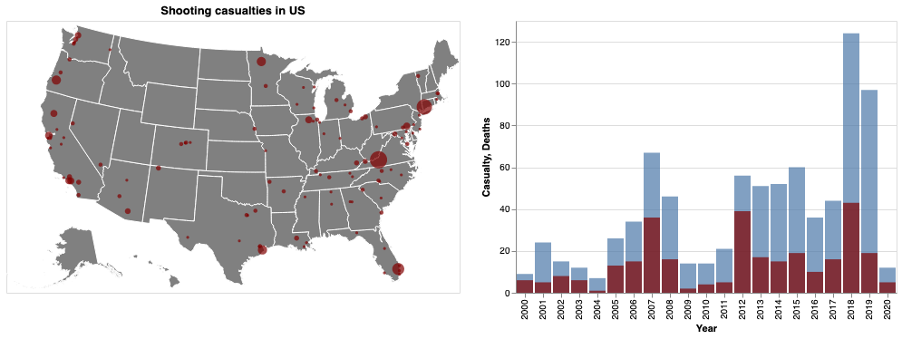

# wiki_k12_shooting

Scrapping on [k12 shooting table in wikipedia](https://en.wikipedia.org/wiki/List_of_school_shootings_in_the_United_States)
 
 - Adding geographical info Longitude and Latittude
 
 - Data clean
 
 - Saved in prosessed_data.csv 
 
 

# Data Mining 

1. Useing __Roberta__ model to do Q/A task on "Descripton column", I asked __"Which school?"__ to extracted School name, and also did Spacy NER looking for "ORG" for benchmarking, the result shows Roberta extracted data more effectively.
2. Using GCP Place API to find school's information on google map, the queried data inludes detailed address, location, useer reviews etc. I extracted county data and saved in 'County" column with school_county.csv
3. School's google map detail information is saved in school_detail.pkl, it is a dictionary, key is the index of school_county.csv.
